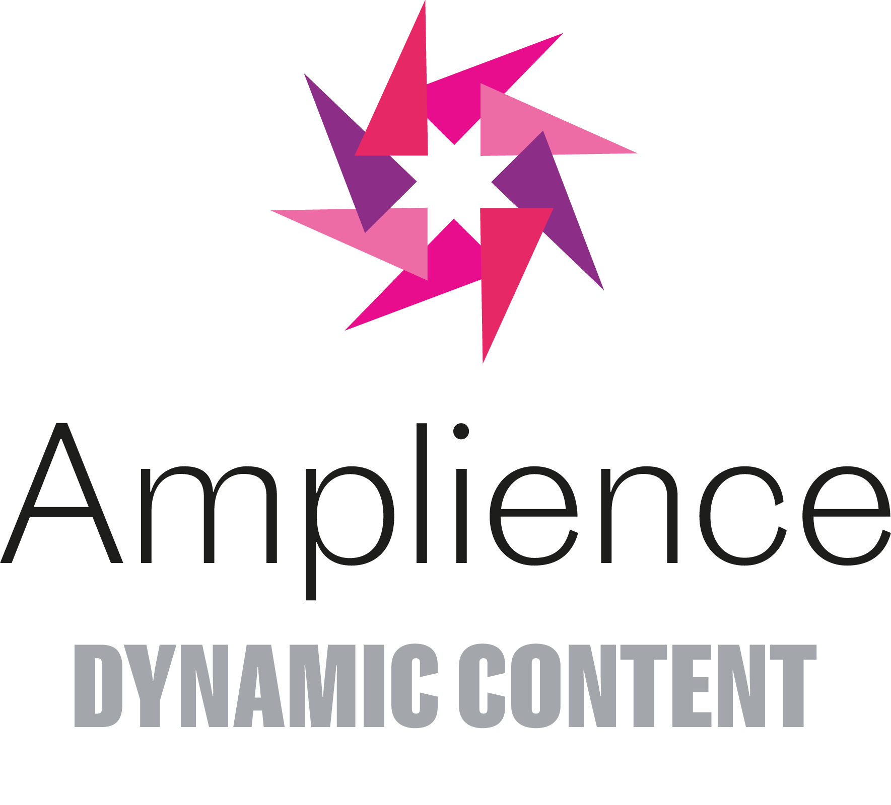

[](https://amplience.com/dynamic-content)

# dc-management-sdk-js

> Official Javascript SDK for the Amplience Dynamic Content API

>)
[](https://badge.fury.io/js/dc-management-sdk-js)

The management sdk is designed to help build back-office applications such as content automation or web-hook integrations. Please keep in mind the management api is rate limited.

## Installation

Using npm:

```sh
npm install dc-management-sdk-js --save
```

## Usage

This sdk can be used with both typescript running on Node.js or regular Javascript running on Node.js. TypeScript type definition files are bundled with the library along with precompiled Javascript versions of all TypeScript classes.

### TypeScript

```typescript
import { DynamicContent } from 'dc-management-sdk-js';
```

### Node.js

```js
var dc = require('dc-management-sdk-js');
```

### Authentication

The content management API uses OAuth 2 to authenticate requests.
When creating an API client you can provide your API key and secret
and the client will handle creating authentication tokens.

For assistance creating API credentials and configuring permissions please contact [Amplience Support](https://support.amplience.com/).

```typescript
const client = new DynamicContent({
  client_id: process.env.CLIENT_ID,
  client_secret: process.env.CLIENT_SECRET,
});
```

OR

```javascript
var client = new dc.DynamicContent({
  client_id: process.env.CLIENT_ID,
  client_secret: process.env.CLIENT_SECRET,
});
```

### Making requests

The most common top level resources (such as Hub and ContentItem) can be requested directly by calling the appropriate method on the client instance. This will return a native promise that will yield the resource or an error (e.g. if you do not have permission to access the resource).

```javascript
var hubs = client.hubs.list();
var hub = client.hubs.get('<HUB-ID>');
var event = client.events.get('<EVENT-ID>');
var edition = client.editions.get('<EDITION-ID>');
var contentItem = client.contentItems.get('<CONTENT-ITEM-ID>');
```

Once you have a top-level resource, you can lookup related resources and perform related actions by calling one of the methods under the “related” object. Each resource has a different set of related resources and actions.

```javascript
var contentRepositories = hub.related.contentRepositories.list();
var editionEvent = edition.related.event();
var contentItemVersion2 = contentItem.related.contentItemVersion(2);
```

## Example

```typescript
import { DynamicContent, Event } from 'dc-management-sdk-js';

async function createEvent() {
  const client = new DynamicContent({
    client_id: process.env.CLIENT_ID,
    client_secret: process.env.CLIENT_SECRET,
  });

  const hubs = await client.hubs.list();
  const hub = hubs.getItems()[0];

  let event = new Event();
  event.name = 'happy new year';
  event.start = '2019-01-01T00:00:00.000Z';
  event.end = '2019-01-01T23:59:59.999Z';

  event = await hub.related.events.create(event);

  console.log(event);
}

createEvent();
```

OR

```javascript
var dc = require('dc-management-sdk-js');

function createEvent() {
  var client = new dc.DynamicContent({
    client_id: process.env.CLIENT_ID,
    client_secret: process.env.CLIENT_SECRET,
  });

  client.hubs
    .list()
    .then(function (hubs) {
      var hub = hubs.getItems()[0];

      var event = new dc.Event();
      event.name = 'happy new year';
      event.start = '2019-01-01T00:00:00.000Z';
      event.end = '2019-01-01T23:59:59.999Z';

      return hub.related.events.create(event);
    })
    .then(function (event) {
      console.log(event);
    });
}

createEvent();
```

## Documentation

Please use the following documentation resources to assist building your application:

- Dynamic Content Management SDK [Reference documentation](https://amplience.github.io/dc-management-sdk-js/)
- Dynamic Content Management API [Reference documentation](https://amplience.com/docs/api/dynamic-content/management/)
- Dynamic Content [User guide](https://docs.amplience.net/)

## Getting Help

If you need help using the sdk please reach out using one of the following channels:

- Ask a question on [StackOverflow](https://stackoverflow.com/) using the tag `amplience-dynamic-content`
- Open a support ticket with [Amplience Support](https://support.amplience.com/)
- Contact your [Amplience Customer Success](https://amplience.com/customer-success) representative
- If you have found a bug please report it by [opening an issue](https://github.com/amplience/dc-management-sdk-js/issues/new)

## License

This software is licensed under the [Apache License, Version 2.0](http://www.apache.org/licenses/LICENSE-2.0),

Copyright 2018 Amplience

Licensed under the Apache License, Version 2.0 (the "License");
you may not use this file except in compliance with the License.
You may obtain a copy of the License at

    http://www.apache.org/licenses/LICENSE-2.0

Unless required by applicable law or agreed to in writing, software
distributed under the License is distributed on an "AS IS" BASIS,
WITHOUT WARRANTIES OR CONDITIONS OF ANY KIND, either express or implied.
See the License for the specific language governing permissions and
limitations under the License.
